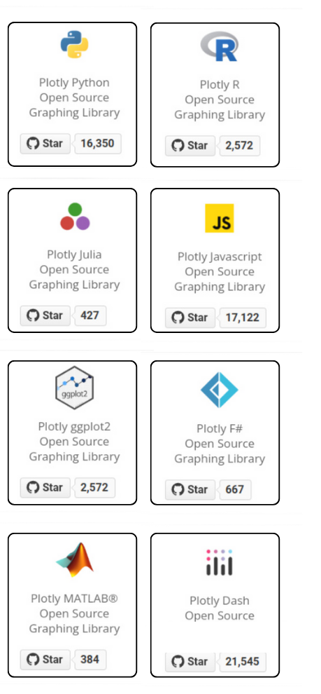

# Análise de Dados com Python
## Semana da Ciência de Dados 2024


<footer style="font-size: 28px;">
<image src="images/github-icon.png" width="30px" style="vertical-align: middle;">
https://github.com/michaelsouza/SCD/tree/main/2024/minicurso
</footer>

---
## Agenda do Minicurso

- Fundamentos de Análise de Dados
- Manipulação de Dados (NumPy e Pandas)
- Limpeza e Preparação de Dados
- Análise Exploratória de Dados (EDA)
- Visualização de Dados (Plotly)


---

# Fundamentos de Análise de Dados

---

## Fundamentos de Análise de Dados
### O que é Análise de Dados?
- Inspeção, limpeza e modelagem de dados
- Objetivo: extrair insights úteis
- Fundamental em:
  - Negócios
  - Pesquisa científica
  - Tomada de decisões

<div style="position: absolute; top: 10%; left: 53%; width: 45%; height: 80%; z-index: -1; background-image: url('images/ciclo_de_vida.png'); background-size: cover; background-position: center;"></div>

---

### Exemplo de Ciclo de Utilização de Dados

1. **Objetivo**: Identificar padrões em geometrias de proteínas obtidas por RMN.  
2. **Coleta**: Baixamos todas as proteínas do PDB geradas por RMN.
3. **Higienização**: Fragmentos ausentes foram ajustados criando subsequências contínuas.  
4. **Processamento**: Transformamos geometrias em árvores binárias.  


---

5. **Normalização**: Ajustamos a orientação do quarto átomo para evitar reflexões.  
6. **Análise**: Medimos o desvio em relação a uma distribuição uniforme.  
7. **Visualização**: Criamos histogramas das sequências binárias.  
8. **Aplicação**: Propusemos um novo método de classificação de proteínas.  


---
## Ferramentas Python para Análise de Dados

- **Computação numérica**: NumPy
- **Tabelas e Séries**: Pandas
- **Visualizações Estáticas**: Matplotlib, Seaborn
- **Visualizações Interativas**: Plotly

<div style="position: absolute; top: 35%; left: 75%; width: 20%; height: 35%; z-index: -1; background-image: url('images/tools-icon.png'); background-size: cover; background-position: center;"></div>

---


---
## O que é NumPy (*Numerical Python*)?

- Biblioteca fundamental para computação científica
- Suporte para arrays multidimensionais
- Funções matemáticas de alto desempenho
- Base para outras bibliotecas de análise de dados
  - Pandas
  - Matplotlib
  - Scikit-learn


---
## Criação de Arrays NumPy

```python
import numpy as np

# Criação básica
array_1d = np.array([1, 2, 3, 4, 5])
array_2d = np.array([[1, 2, 3], [4, 5, 6]])

# Funções de geração
zeros = np.zeros((3, 3))  # Matriz de zeros
uns = np.ones((2, 4))     # Matriz de uns
aleatorio = np.random.rand(3, 3)  # Matriz aleatória
```

### Tipos de Arrays
- Unidimensionais, Bidimensionais, Multidimensionaiss

---
## Propriedades dos Arrays

```python
# Investigando características
print(array_2d.shape)     # Dimensões
print(array_2d.dtype)     # Tipo de dados
print(array_2d.ndim)      # Número de dimensões
print(array_2d.size)      # Número total de elementos
```

### Características
- Tipagem estática
- Memória contígua
- Alta performance computacional

---
## Broadcasting

```python
# Operação com escalar
array = np.array([1, 2, 3])
resultado = array + 10  # [11, 12, 13]

# Operação com arrays de formas diferentes
a = np.array([[1], [2], [3]])
b = np.array([1, 2, 3])
resultado = a + b

```

---
## Broadcasting em Ação

```python
# Matriz de Distâncias
points = np.random.rand(num_points, 2) # Pontos no plano

# Compute the distance matrix using broadcasting
diff = points[:, np.newaxis, :] - points[np.newaxis, :, :]
dist_matrix = np.sqrt(np.sum(diff**2, axis=-1))
```

### Exercício: 
Compare a peformance do broadcasting com loops tradicionais.

---
## Operações Matemáticas

```python
# Operações elemento por elemento
a = np.array([1, 2, 3])
b = np.array([4, 5, 6])

# Soma
soma = a + b  # [5, 7, 9]

# Multiplicação
multiplicacao = a * b  # [4, 10, 18]

# Operações universais
print(np.mean(a))    # Média
print(np.sum(a))     # Soma
print(np.max(a))     # Máximo
```

---
## Indexação e Fatiamento (*Slice*)

```python
# Indexação simples
array_2d = np.array([[1, 2, 3], [4, 5, 6], [7, 8, 9]])

# Seleção de elemento
print(array_2d[1, 2])  # Elemento na 2ª linha, 3ª coluna

# Fatiamento
print(array_2d[0:2, 1:3])  # Subarray
print(array_2d[:, 1])      # Coluna específica
print(array_2d[2, :])      # Linha específica

# Indexação booleana
print(array_2d[array_2d > 5])

```

---
## Reshape e Operações de Transformação

```python
# Mudança de formato
array_original = np.arange(12)
array_reshape = array_original.reshape((3, 4))

# Transposição
transposta = array_reshape.T

# Concatenação
a = np.array([1, 2, 3])
b = np.array([4, 5, 6])
concatenado = np.concatenate([a, b])
```

---
## Funções Matemáticas Avançadas

```python
# Funções trigonométricas
angulos = np.array([0, np.pi/2, np.pi])
senos = np.sin(angulos)

# Álgebra linear
matriz_a = np.array([[1, 2], [3, 4]])
matriz_b = np.array([[5, 6], [7, 8]])

# Multiplicação de matrizes
produto = np.dot(matriz_a, matriz_b)

# Autovalores e autovetores
autovalores, autovetores = np.linalg.eig(matriz_a)
```

---
## Geração de Números Aleatórios

```python
# Distribuições
uniforme = np.random.uniform(0, 1, 5)
normal = np.random.normal(0, 1, 5)
inteiros = np.random.randint(0, 10, 5)

# Semente para reprodutibilidade
np.random.seed(42)
aleatorio = np.random.rand(3)
```

---
## Integração com Outras Bibliotecas

### NumPy como Base Computacional
- Pandas: Conversão de estruturas
- Matplotlib: Fonte de dados para visualização

```python
import pandas as pd
import matplotlib.pyplot as plt

# Conversão NumPy para Pandas
serie_numpy = np.random.rand(50)
serie_pandas = pd.Series(serie_numpy)

# Plotagem direta
plt.plot(serie_numpy)
plt.show()
```

---
## Boas Práticas

- Usar vetorização ao invés de loops
- Escolher tipos de dados apropriados
- Evitar cópias desnecessárias de arrays


---

### Gargalo de Memória

<div style="border: 0px solid #ccc; border-radius: 10px; padding: 10px; margin: 10px; display: flex; justify-content: space-between; gap: 20px;">  
  <div style="width: 48%; border: 1px solid #ccc; padding: 10px; border-radius: 10px;">

#### CPU Specifications

- **Processor:** Intel i9-14900KS
- **Cores:** 24
- **Clock Speed (Turbo):** 6.2 GHz
- **Instructions per Cycle:** 2
- **Data/Instruction:** 8 bytes
- **CPU Data Rate:** 2380.8 GB/s

</div>
<div style="width: 48%; border: 1px solid #ccc; padding: 10px; border-radius: 10px;">

#### Memory Specifications

- **Memory Type:** DDR5-5600
- **2x Bandwidth:** 89.6 GB/s

#### <span style="color: red;">Bottleneck</span>

- **CPU Demand:** 2380.8 GB/s
- **Memory Bandwidth:** 89.6 GB/s
- **Bottleneck Ratio:** <span style="color: red;">**26.6x**</span>

</div>
</div>

<footer>
https://www.techpowerup.com/cpu-specs/core-i9-14900ks.c3522
<br>
https://www.crucial.com/articles/about-memory/everything-about-ddr5-ram
</footer>

---

### Gargalo de Memória

```python
import numpy as np

# Define the size of the array
array_size = 10_000_000

# Create arrays with different data types
int32_array = np.random.randint(0, 100, size=array_size, dtype=np.int32)
int64_array = np.random.randint(0, 100, size=array_size, dtype=np.int64)
float32_array = np.random.rand(array_size).astype(np.float32)
float64_array = np.random.rand(array_size).astype(np.float64)
```

#### Exercício: 
Compare o tempo de execução para operações com diferentes tipos de dados.

---

<!-- backgroundColor: orange -->
# Perguntas?

---

<!-- backgroundColor: white -->


---

## O que é o Pandas?

- **Pandas** é uma biblioteca de código aberto para a linguagem Python.
- Fornece estruturas de dados de alto desempenho e ferramentas de análise de dados.
- Baseado no NumPy, oferece estruturas como **Series** e **DataFrame** para manipulação eficiente de dados.


---

## Principais Funcionalidades do Pandas

- Manipulação e análise de dados tabulares e estruturados.
- Leitura e escrita de dados em vários formatos (CSV, Excel, SQL, etc.).
- Limpeza e preparação de dados.
- Seleção, filtragem e agregação de dados.
- Manipulação de séries temporais.


---

## Estruturas de Dados Principais

### Series

- Vetor unidimensional rotulado, capaz de armazenar qualquer tipo de dado.
- Similar a um array do NumPy, mas com rótulos de índice.

```python
import pandas as pd

# Criando uma Series a partir de uma lista
numeros = pd.Series([10, 20, 30, 40, 50])
print(numeros)
```

---

## Trabalhando com Séries Temporais

- Manipulação eficiente de dados baseados em tempo.
- Funções para resampling, time shifting e windowing.

```python
import pandas as pd
import numpy as np

# Criando uma Series temporal
datas = pd.date_range('2024-01-01', periods=5, freq='D')
valores = np.random.rand(5)
serie_temporal = pd.Series(valores, index=datas)
print(serie_temporal)
```

---

### DataFrame

- Estrutura de dados bidimensional com rótulos nas linhas e colunas.
- Equivalente a uma planilha ou tabela SQL.

```python
import pandas as pd

# Criando um DataFrame a partir de um dicionário
dados = {
    'Nome': ['Ana', 'Carlos', 'Maria'],
    'Idade': [25, 30, 22],
    'Salário': [5000, 6000, 4500]
}

df = pd.DataFrame(dados)
print(df)
```

---

## Carregando Dados de Fontes Externas

- **CSV**: Arquivos de valores separados por vírgulas.
- **Excel**: Planilhas do Microsoft Excel.
- **SQL**: Bancos de dados relacionais.

```python
import pandas as pd

# Leitura de um arquivo CSV
df_csv = pd.read_csv('dados.csv')

# Leitura de um arquivo Excel
df_excel = pd.read_excel('planilha.xlsx')
```

---

## Seleção e Filtragem de Dados

- **Seleção de colunas**: Acessar uma ou mais colunas por nome.
- **Filtragem de linhas**: Selecionar linhas que atendem a certas condições.

```python
# Selecionando uma coluna
nomes = df['Nome']
print(nomes)

# Selecionando múltiplas colunas
nome_salario = df[['Nome', 'Salário']]
print(nome_salario)

# Filtrando linhas com base em uma condição
jovens = df[df['Idade'] < 28]
print(jovens)
```

---

## Operações de Agregação

- **Estatísticas descritivas**: mean, sum, count, min, max, etc.
- **Agrupamento de dados**: groupby para agrupar e agregar dados.

```python
# Calculando a média dos salários
media_salario = df['Salário'].mean()
print(f"Média salarial: {media_salario}")

# Agrupando por departamento e calculando a média salarial
df['Departamento'] = ['RH', 'TI', 'Vendas']
media_por_departamento = df.groupby('Departamento')['Salário'].mean()
print(media_por_departamento)
```

---

## Manipulação de Dados

- **Adição de colunas**: Criar novas colunas baseadas em cálculos ou condições.
- **Ordenação**: Organizar os dados com base em uma ou mais colunas.
- **Tratamento de valores ausentes**: dropna, fillna.

```python
# Adicionando uma nova coluna de bônus
df['Bônus'] = df['Salário'] * 0.1

# Ordenando o DataFrame por idade decrescente
df_ordenado = df.sort_values('Idade', ascending=False)
print(df_ordenado)

# Tratando valores ausentes
df_limpo = df.dropna()       # Remove linhas com valores ausentes
df_preenchido = df.fillna(0) # Substitui valores ausentes por 0
```
---

## Conversão entre Estruturas de Dados

- **Series para DataFrame**
- **DataFrame para NumPy array**
- **DataFrame para dicionário**

```python
# Series para DataFrame
serie = pd.Series([1, 2, 3], name='Números')
df_from_series = serie.to_frame()
print(df_from_series)

# DataFrame para NumPy array
array_numerico = df.to_numpy()
print(array_numerico)

# DataFrame para dicionário
dict_dados = df.to_dict()
print(dict_dados)
```

---

## Limpeza e Preparação de Dados

- **Tratamento de valores ausentes**
- **Remoção de duplicatas**
- **Conversão de tipos de dados**
- **Normalização e padronização**

```python
# Removendo valores ausentes
df_sem_na = df.dropna()

# Removendo duplicatas
df_unico = df.drop_duplicates()

# Convertendo tipos de dados
df['Idade'] = df['Idade'].astype(float)
```

---

## Integração com Outras Bibliotecas

- **NumPy**: Operações numéricas de baixo nível.
- **Matplotlib** e **Seaborn**: Visualização de dados.
- **Scikit-learn**: Aprendizado de máquina.

```python
import matplotlib.pyplot as plt

# Gráfico de barras do salário por nome
df.plot.bar(x='Nome', y='Salário')
plt.show()
```

---

<!-- backgroundColor: orange -->

# Perguntas?

---
<!-- backgroundColor: white -->


---

## Plotly
- Biblioteca de visualização de código aberto.
- Gráficos estáticos, **animados** e **interativos**.
- **Portabilidade** para outras linguagens.


  
---
### Instalação

```python
!pip install plotly           # Instalação
import plotly.express as px   # Importação
import pandas as pd           # Importação

# Leitura de Dados
df = pd.read_excel('dados.csv')
```

## 1. Gráfico de Barras

- **Uso**: Comparar valores entre diferentes categorias.

```python
# Gráfico de Barras
fig = px.bar(df, x='Categoria', y='Valores', title='Gráfico de Barras')
fig.show()
```

---

## 2. Histograma

- **Uso**: Mostrar a distribuição de uma variável numérica.

```python
# Dados para o histograma
df_hist = pd.DataFrame({'Dados': np.random.randn(500)})

# Histograma
fig = px.histogram(df_hist, x='Dados', nbins=20, title='Histograma')
fig.show()
```

---

## 3. Boxplot

- **Uso**: Resumir a distribuição de dados e identificar outliers.

```python
# Boxplot por Grupo
fig = px.box(df_extra, x='Grupo', y='Salário', title='Boxplot de Salários por Grupo')
fig.show()
```

---

## 4. Gráfico de Dispersão (Scatter Plot)

- **Uso**: Visualizar a relação entre duas variáveis numéricas.

```python
# Gráfico de Dispersão
fig = px.scatter(df_extra, x='Idade', y='Salário', color='Grupo', title='Idade vs. Salário')
fig.show()
```

---

## 5. Gráfico de Linha

- **Uso**: Representar dados sequenciais ou séries temporais.

```python
# Gráfico de Linha
fig = px.line(df_extra, x='Data', y='Valor_Temporal', title='Tendência ao Longo do Tempo')
fig.show()
```

---

<!-- backgroundColor: orange -->

# Perguntas?

---

<!-- backgroundColor: white -->

# Análise Exploratória de Dados 
## *Exploratory Data Analysis* (EDA)


---
## Análise Exploratória de Dados (EDA)

### Estatísticas Descritivas (Medidas)

<div style="border: 0px solid #ccc; border-radius: 10px; padding: 10px; margin: 10px; display: flex; justify-content: space-between; gap: 20px;">  
  <div style="width: 48%; border: 1px solid #ccc; padding: 10px; border-radius: 10px;">

#### Centralidade
- Média
- Mediana
- Moda

  </div>
  <div style="width: 48%; border: 1px solid #ccc; padding: 10px; border-radius: 10px;">

#### Dispersão
- Desvio padrão
- Variância

  </div>
  <div style="width: 48%; border: 1px solid #ccc; padding: 10px; border-radius: 10px;">

#### Correlação
- Determinação
- Pearson

  </div>
</div>

<footer style="font-size: 28px;">

👉 [CC0218 Coeficiente de Correlação (link)](https://docs.google.com/presentation/d/1maI_UlPjDBHtq57pMSJjToociymic2pJ/edit?usp=sharing&ouid=112763014768929227816&rtpof=true&sd=true)

</footer>

---

<!-- backgroundColor: white -->

# Obrigado!

