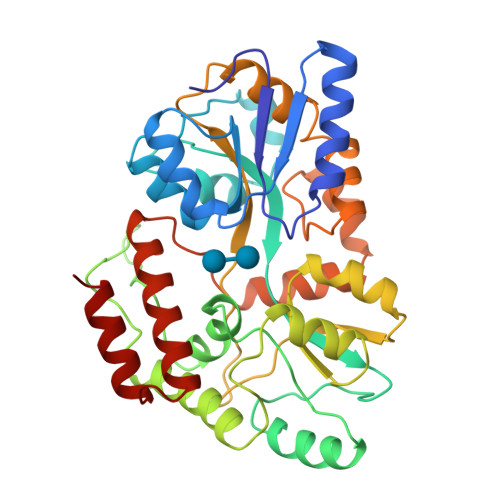

# Análise de Dados com Python
## Semana da Ciência de Dados 2024


---
## Agenda do Minicurso

- Fundamentos de Análise de Dados
- Manipulação de Dados (NumPy e Pandas)
- Limpeza e Preparação de Dados
- Análise Exploratória de Dados (EDA)
- Visualização de Dados (Matplotlib, Seaborn e Plotly)

---

# Fundamentos de Análise de Dados

---

## Fundamentos de Análise de Dados
### O que é Análise de Dados?
- Inspeção, limpeza e modelagem de dados
- Objetivo: extrair insights úteis
- Fundamental em:
  - Negócios
  - Pesquisa científica
  - Tomada de decisões

<div style="position: absolute; top: 10%; left: 53%; width: 45%; height: 80%; z-index: -1; background-image: url('images/ciclo_de_vida.webp'); background-size: cover; background-position: center;"></div>

---

### Exemplo de Ciclo de Utilização de Dados

1. **Objetivo**: Identificar padrões em geometrias de proteínas obtidas por RMN.  
2. **Coleta**: Baixamos todas as proteínas do PDB geradas por RMN.
3. **Higienização**: Fragmentos ausentes foram ajustados criando subsequências contínuas.  
4. **Processamento**: Transformamos geometrias em árvores binárias.  


---

5. **Normalização**: Ajustamos a orientação do quarto átomo para evitar reflexões.  
6. **Análise**: Medimos o desvio em relação a uma distribuição uniforme.  
7. **Visualização**: Criamos histogramas das sequências binárias.  
8. **Aplicação**: Propusemos um novo método de classificação de proteínas.  



---
## Ferramentas Python para Análise de Dados

- **Computação numérica**: NumPy
- **Tabelas e Séries**: Pandas
- **Visualizações Estáticas**: Matplotlib, Seaborn
- **Visualizações Interativas**: Plotly

<div style="position: absolute; top: 35%; left: 75%; width: 20%; height: 35%; z-index: -1; background-image: url('images/tools-icon.png'); background-size: cover; background-position: center;"></div>

---


---
## O que é NumPy (*Numerical Python*)?

- Biblioteca fundamental para computação científica
- Suporte para arrays multidimensionais
- Funções matemáticas de alto desempenho
- Base para outras bibliotecas científicas
  - Pandas
  - Matplotlib
  - Scikit-learn

---
## Criação de Arrays NumPy

```python
import numpy as np

# Criação básica
array_1d = np.array([1, 2, 3, 4, 5])
array_2d = np.array([[1, 2, 3], [4, 5, 6]])

# Funções de geração
zeros = np.zeros((3, 3))  # Matriz de zeros
uns = np.ones((2, 4))     # Matriz de uns
aleatorio = np.random.rand(3, 3)  # Matriz aleatória
```

### Tipos de Arrays
- Unidimensionais, Bidimensionais, Multidimensionaiss

---
## Propriedades dos Arrays

```python
# Investigando características
print(array_2d.shape)     # Dimensões
print(array_2d.dtype)     # Tipo de dados
print(array_2d.ndim)      # Número de dimensões
print(array_2d.size)      # Número total de elementos
```

### Características
- Tipagem estática
- Memória contígua
- Alta performance computacional

---
## Broadcasting

```python
# Operação com escalar
array = np.array([1, 2, 3])
resultado = array + 10  # [11, 12, 13]

# Operação com arrays de formas diferentes
a = np.array([[1], [2], [3]])
b = np.array([1, 2, 3])
resultado = a + b

```

---
## Broadcasting em Ação

```python
# Matriz de Distâncias
points = np.random.rand(num_points, 2) # Pontos no plano

# Compute the distance matrix using broadcasting
diff = points[:, np.newaxis, :] - points[np.newaxis, :, :]
dist_matrix = np.sqrt(np.sum(diff**2, axis=-1))
```

### Exercício: 
Compare a peformance do broadcasting com loops tradicionais.

---
## Operações Matemáticas

```python
# Operações elemento por elemento
a = np.array([1, 2, 3])
b = np.array([4, 5, 6])

# Soma
soma = a + b  # [5, 7, 9]

# Multiplicação
multiplicacao = a * b  # [4, 10, 18]

# Operações universais
print(np.mean(a))    # Média
print(np.sum(a))     # Soma
print(np.max(a))     # Máximo
```

---
## Indexação e Fatiamento

```python
# Indexação simples
array_2d = np.array([[1, 2, 3], [4, 5, 6], [7, 8, 9]])

# Seleção de elemento
print(array_2d[1, 2])  # Elemento na 2ª linha, 3ª coluna

# Fatiamento
print(array_2d[0:2, 1:3])  # Subarray
print(array_2d[:, 1])      # Coluna específica

# Indexação booleana
print(array_2d[array_2d > 5])

```

---
## Reshape e Operações de Transformação

```python
# Mudança de formato
array_original = np.arange(12)
array_reshape = array_original.reshape((3, 4))

# Transposição
transposta = array_reshape.T

# Concatenação
a = np.array([1, 2, 3])
b = np.array([4, 5, 6])
concatenado = np.concatenate([a, b])
```

---
## Funções Matemáticas Avançadas

```python
# Funções trigonométricas
angulos = np.array([0, np.pi/2, np.pi])
senos = np.sin(angulos)

# Álgebra linear
matriz_a = np.array([[1, 2], [3, 4]])
matriz_b = np.array([[5, 6], [7, 8]])

# Multiplicação de matrizes
produto = np.dot(matriz_a, matriz_b)

# Autovalores e autovetores
autovalores, autovetores = np.linalg.eig(matriz_a)
```

---
## Geração de Números Aleatórios

```python
# Distribuições
uniforme = np.random.uniform(0, 1, 5)
normal = np.random.normal(0, 1, 5)
inteiros = np.random.randint(0, 10, 5)

# Semente para reprodutibilidade
np.random.seed(42)
aleatorio = np.random.rand(3)
```

---
## Integração com Outras Bibliotecas

### NumPy como Base Computacional
- Pandas: Conversão de estruturas
- Matplotlib: Fonte de dados para visualização

```python
import pandas as pd
import matplotlib.pyplot as plt

# Conversão NumPy para Pandas
serie_numpy = np.random.rand(50)
serie_pandas = pd.Series(serie_numpy)

# Plotagem direta
plt.plot(serie_numpy)
plt.show()
```

---
## Boas Práticas

- Usar vetorização ao invés de loops
- Escolher tipos de dados apropriados
- Evitar cópias desnecessárias de arrays


---

### Gargalo de Memória

<div style="border: 0px solid #ccc; border-radius: 10px; padding: 10px; margin: 10px; display: flex; justify-content: space-between; gap: 20px;">  
  <div style="width: 48%; border: 1px solid #ccc; padding: 10px; border-radius: 10px;">

#### CPU Specifications

- **Processor:** Intel i9-14900KS
- **Cores:** 24
- **Clock Speed (Turbo):** 6.2 GHz
- **Instructions per Cycle:** 2
- **Data/Instruction:** 8 bytes
- **CPU Data Rate:** 2380.8 GB/s

</div>
<div style="width: 48%; border: 1px solid #ccc; padding: 10px; border-radius: 10px;">

#### Memory Specifications

- **Memory Type:** DDR5-5600
- **2x Bandwidth:** 89.6 GB/s

#### <span style="color: red;">Bottleneck</span>

- **CPU Demand:** 2380.8 GB/s
- **Memory Bandwidth:** 89.6 GB/s
- **Bottleneck Ratio:** <span style="color: red;">**26.6x**</span>

</div>
</div>

<footer>
https://www.techpowerup.com/cpu-specs/core-i9-14900ks.c3522
<br>
https://www.crucial.com/articles/about-memory/everything-about-ddr5-ram
</footer>

---

### Gargalo de Memória

```python
import numpy as np

# Define the size of the array
array_size = 10_000_000

# Create arrays with different data types
int32_array = np.random.randint(0, 100, size=array_size, dtype=np.int32)
int64_array = np.random.randint(0, 100, size=array_size, dtype=np.int64)
float32_array = np.random.rand(array_size).astype(np.float32)
float64_array = np.random.rand(array_size).astype(np.float64)
```

#### Exercício: 
Compare o tempo de execução para operações com diferentes tipos de dados.

---

<!-- backgroundColor: orange -->
# Perguntas?

---

<!-- backgroundColor: white -->


---

## Manipulação de Dados com Pandas

### Estruturas Principais
- **Series**: Vetor unidimensional
- **DataFrame**: Tabela de dados bidimensional

```python
import pandas as pd

# Criando um DataFrame
df = pd.DataFrame({
    'Nome': ['Ana', 'Carlos', 'Maria'],
    'Idade': [25, 30, 22],
    'Salário': [5000, 6000, 4500]
})
```

---
## Operações Básicas com Pandas

- Carregamento de dados
- Seleção e filtragem
- Agregação
- Grupamento

```python
# Exemplo de filtragem
jovens = df[df['Idade'] < 30]

# Exemplo de agregação
media_salario = df['Salário'].mean()
```
---
### Series: Vetor Unidimensional

```python
import pandas as pd
import numpy as np

# Criando uma Series a partir de uma lista
numeros = pd.Series([10, 20, 30, 40, 50])
print(numeros)

# Series Temporais com Datas
```python
import pandas as pd
import numpy as np

# Criando uma Series temporal
datas = pd.date_range('2024-01-01', periods=5, freq='D')
valores = np.random.rand(5)
serie_temporal = pd.Series(valores, index=datas)
print(serie_temporal)
```

---

### Características das Series
- Similar a um array NumPy com rótulos de índice
- Pode conter diferentes tipos de dados
- Operações vetoriais
- Indexação flexível

---
## DataFrame: Tabela de Dados

```python
# 1. A partir de um dicionário
df_funcionarios = pd.DataFrame({
    'Nome': ['Ana', 'Carlos', 'Maria'],
    'Idade': [25, 30, 22],
    'Salário': [5000, 6000, 4500],
    'Departamento': ['RH', 'TI', 'Vendas']
})

# 2. A partir de um NumPy array
dados_matriz = np.random.randint(0, 100, size=(4, 3))
df_random = pd.DataFrame(
    dados_matriz, 
    columns=['Valor1', 'Valor2', 'Valor3']
)

# 3. Leitura de fontes externas
df_csv = pd.read_csv('dados.csv')
df_excel = pd.read_excel('planilha.xlsx')
```

---
## Operações Básicas com DataFrames

```python
# Informações sobre o DataFrame
print(df_funcionarios.info())
print(df_funcionarios.describe())

# Seleção de Dados
# Seleção de coluna
print(df_funcionarios['Nome'])

# Seleção de linhas
print(df_funcionarios.loc[0])  # Primeira linha
print(df_funcionarios.iloc[0:2])  # Primeiras duas linhas

# Filtragem condicional
jovens = df_funcionarios[df_funcionarios['Idade'] < 28]
ti_dept = df_funcionarios[df_funcionarios['Departamento'] == 'TI']
```

---
## Manipulação Avançada

```python
# Agregações
print(df_funcionarios.groupby('Departamento')['Salário'].mean())

# Ordenação
df_ordenado = df_funcionarios.sort_values('Idade', ascending=False)

# Adição de novas colunas
df_funcionarios['Bonus'] = df_funcionarios['Salário'] * 0.1

# Tratamento de valores ausentes
df_limpo = df_funcionarios.dropna()
df_preenchido = df_funcionarios.fillna(0)
```

---
## Conversão entre Estruturas

```python
# Series para DataFrame
serie = pd.Series([1, 2, 3], name='Números')
df_from_series = serie.to_frame()

# DataFrame para NumPy array
array_numerico = df_funcionarios.to_numpy()

# Dicionário a partir do DataFrame
dict_funcionarios = df_funcionarios.to_dict()
```

### Observações Importantes
- Flexibilidade na manipulação de dados
- Integração com NumPy
- Múltiplas formas de criação e transformação

---
## Limpeza e Preparação de Dados

### Técnicas Essenciais
- Tratamento de valores ausentes
- Remoção de duplicatas
- Conversão de tipos
- Normalização

```python
# Removendo valores ausentes
df_limpo = df.dropna()

# Tratando duplicatas
df_unico = df.drop_duplicates()
```
---

<!-- backgroundColor: orange -->

# Perguntas?

---

<!-- backgroundColor: white -->

# Análise Exploratória de Dados 
## *Exploratory Data Analysis* (EDA)


---
## Análise Exploratória de Dados (EDA)

### Estatísticas Descritivas

<div style="border: 0px solid #ccc; border-radius: 10px; padding: 10px; margin: 10px; display: flex; justify-content: space-between; gap: 20px;">  
  <div style="width: 48%; border: 1px solid #ccc; padding: 10px; border-radius: 10px;">

#### Medidas de tendência central
- Média
- Mediana
- Moda

  </div>
  <div style="width: 48%; border: 1px solid #ccc; padding: 10px; border-radius: 10px;">

#### Medidas de dispersão
- Desvio padrão
- Variância

  </div>
</div>

---
## Correlação de Dados

### Tipos de Correlação
- $R^2$ (coeficiente de determinação)
[Material CC0218 Correlação](https://docs.google.com/presentation/d/1maI_UlPjDBHtq57pMSJjToociymic2pJ/edit?usp=sharing&ouid=112763014768929227816&rtpof=true&sd=true)
- Pearson (relações lineares)

---
## Visualização de Dados

### Bibliotecas
- Matplotlib: Visualizações básicas
- Seaborn: Visualizações estatísticas
- Plotly: Visualizações interativas

```python
import plotly.express as px

# Gráfico interativo
fig = px.scatter(df, x='Idade', y='Salário')
fig.show()
```

---
## Visualizações Avançadas com Plotly

- Gráficos 3D
- Dashboards interativos
- Mapas de calor
- Gráficos de superfície

```python
import plotly.graph_objs as go

fig_3d = go.Figure(data=[
    go.Scatter3d(
        x=df['Idade'], 
        y=df['Salário'], 
        z=df['Outro_Dado'],
        mode='markers'
    )
])
```

---

<!-- backgroundColor: orange -->

# Dúvidas?

---

<!-- backgroundColor: white -->

# Obrigado!

